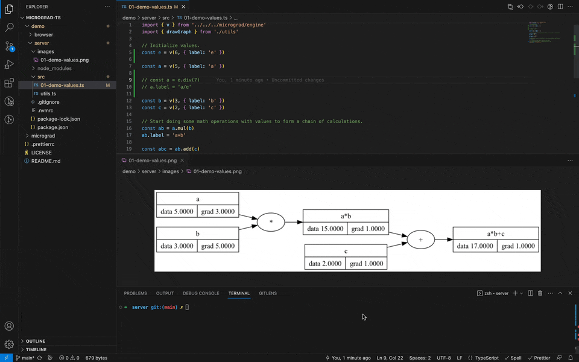

# Micrograd TS

A tiny scalar-valued autograd engine and a neural net library on top of it with PyTorch-like API.

> - This is a TypeScript version of [karpathy/micrograd](https://github.com/karpathy/micrograd) repo.
> - See the [The spelled-out intro to neural networks and back-propagation: building micrograd](https://www.youtube.com/watch?v=VMj-3S1tku0) YouTube video for the detailed  explanation of how neural networks and back propagation work.

This repo might be useful for those who want to get a basic yet deep understanding of how neural networks work, using a TypeScript environment for experimentation.  

## Project structure

- [micrograd/](./micrograd/) — this folder is the core/purpose of the repo
  - [engine.ts](./micrograd/engine.ts) — the scalar `Value` class that supports basic math operations like `add`, `sub`, `div`, `mul`, `pow`, `exp`, `tanh` and has a `backward()` method that calculates a derivative of the expression, which is required for back-propagation flow.
  - [nn.ts](./micrograd/nn.ts) — the `Neuron`, `Layer`, and `MLP` (multi-layer perceptron) classes that implement a neural network on top of the differentiable scalar `Values`.
- [demo/](./demo/) - demos/playgrounds to experiment with the micrograd code
  - [browser/](./demo/browser/) — a demo playground to experiment with the micrograd implementation in the browser
  - [server/](./demo/server/) — a demo playground to experiment with the micrograd implementation in Node.js

## Node.js playground

### Setup

Switch to the Node.js playground folder:

```sh
cd ./demo/server
```

Setup node v18 using [nvm](https://github.com/nvm-sh/nvm) (optional):

```sh
nvm use
```

Install dependencies:

```sh
npm i
```

### Exploring demos

Explore demo files in [./demo/server/src/](./demo/server/src/) folder.

### Running demos

You may run demos using the following command:

```sh
npm start --silent ./src/01-demo-values.ts
```

### Computation graph (debugging)

If you're going to use the `drawGraph()` function from [utils.ts](./demo/server/src/utils.ts) to draw the computation graph of `Values` you need to:
- Install [GraphViz](https://www.graphviz.org)
- Update the `GRAPH_VIZ_BIN_PATH` in [utils.ts](./demo/server/src/utils.ts) if needed (for example you might want to change the `/opt/homebrew/bin` to `/usr/local/bin`)

For debugging purposes, you may open the generated computation graph image from the `./demo/server/images/` folder in a separate IDE tab. Then, every time the demo script is run, the image will be updated in IDE automatically: 



# Author

[@trekhleb](https://trekhleb.dev)
